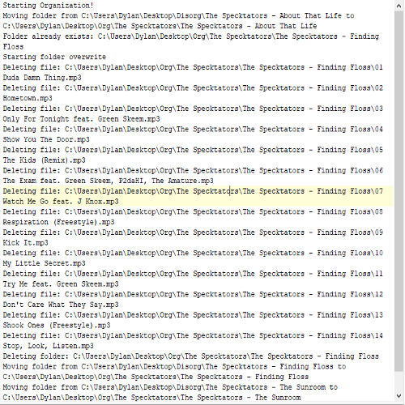

<div class="ui small rounded images">
  
  
</div>

The purpose of creating this project was for me to test file manipulation. The way I went about doing this was to use it to organize my music library such that each folder would be moved to a folder titled with the artist's name. This would allow me to consistently add new albums to the organized folder with each album grouped by the various artists. It should be said that because of the way I name folders, the specifics of the program were written specifically for myself. It is not directed towards a general audience.

As progress was made, many parameters were needed to be checked. In the event that a folder with the artist's name does not exist, a new folder is created. If an album folder already exists within the artist folder, a confirmation window asks whether or not to overwrite the files. Included in the overwrite confirmation is the size of the old folder compared to the size of the new folder to be used for further analysis of whether or not to overwrite. These were some of the main issues that could occur while processing the files and directories. I also kept track of what was going on by writing to a simple text file to further clarify what the program was doing, as seen above, in the first picture.

The following code snippet is the function used to calculate the size of a directory.

```C#
private static long GetDirectorySize(string Path)
{
    long size = 0;

    foreach (var subfile in Directory.EnumerateFiles(Path, "*.*", SearchOption.AllDirectories))
    {
        FileInfo info = new FileInfo(subfile);

        size += info.Length;
    }

    return size;
}
```

There was also the issue of having to find out the artist of the album. This could have been done in a variety of ways, such as using a library like taglib to read the metadata of the actual media files. However, in my case, due to the nature of how I have named these folders, the artist's name was always included in the album folder name. For example, the format for a folder name is "Artist - Album Title". Due to this fact, I just simple used simple strings to get the necessary information. I also used regular expressions so that I was able to only allow numbers and letters. This was to ensure that things like a misplaced ' or whitespace would not be seen as a different artist.

This snippet of code is what was used to only allow numbers and letters. It also removed trailing whitespace and changed everything to lower case. This allowed for a normalized name to be used.
```C#
Regex.Replace(ItemName, "[^0-9a-zA-Z]", string.Empty).ToLower().TrimEnd(' ');
```

The following is a snippet of code that deletes every file in a given directory.

```C#
try
{
    foreach (var FileItem in Directory.EnumerateFiles(MovePath))
    {
        Log("Deleting file: " + FileItem);
        File.Delete(FileItem);
    }

    Log("Deleting folder: " + MovePath);
    Directory.Delete(MovePath);
}
catch(Exception ex)
{
    LogAndShow("Error deleting: " + MovePath, ex);
}
```

The code used may not be perfect, however, it did what I intended it to do. Through this project, I was able to further expand my knowledge with the manipulation of files and directories. Among other things, I was able to delete files, create folders, and enumerate files in a directory. I also learned how to use regular expressions.


