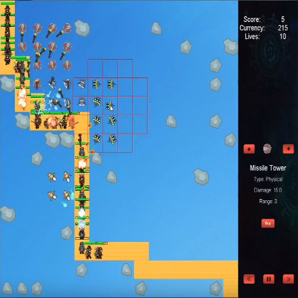

A demo of the game can be found on YouTube, <a href="https://youtu.be/x2SDYRLFoWw"></i>here</a>

This tower defense game was the final project that my team and I submitted for ICS 111. It was coded in Java with the assistance of the EZ Graphics library. Given the amount of time allotted for this project, there were things that had to be left out. For example, the game balancing of unit health and tower damage may not have been scaled correctly. However, despite this, the end result was a success. All of the major elements worked, such as unit and tower creations. The game focused on the aspect that enemies were infinitely spawned in a single wave, on a timer. A map would be randomly created with objects that would block the creation of towers. The player could place towers where they pleased, as long as it did not interfere with the ending path of the enemy units. The player earned currency as they killed enemies, allowing them to upgrade towers. The player lost when a certain amount of enemy units reached the ending point of their path.

Many of the roles for this project became intertwined and as such, many of the aspects were worked on by everyone. A part that I took a big role in was the management of the projectiles created by the towers. There were various towers, such as ice and fire. For each type of tower, a different project had to be made. Many projectiles were animated and given after effects through the use of various sprites. To help reduce the need for creating new projectiles, old ones were cached until they were needed again, at which point they were reused. 

Through this project, the main things that I gained from it was the concept of finite state machines. This concept was used to update the various aspects of the game. For example, if a game was started, then only the game logic is updated. When the player lost, the game state would then change and the game logic would no longer be executed until a new game was made.

The following snippet of code was used to control which aspects of the game was updated depending on the given state.

```Java
while (true)
{
  switch (gsm.getState())
  {
    case NewGame:
      EZ.removeAllEZElements();
      game = new Game(EZ_WIDTH, EZ_HEIGHT, CELL_SIZE, gsm);
      gsm.setState(GameState.Game);
      break;

    case MainMenu:
      EZ.refreshScreen();
      menu.update();
      break;

    case Game:
    case Pause:
      game.update();
      break;
      
    case EndScreen:
      endScreen.update();
      break;

    case Exit:
      System.exit(0);
      break;

    default:
      break;
  }
}
```
 
Source: The source can be found <a href="https://bitbucket.org/dylancn/ics111_project3/src/b8392020a58b4ae84a24588040a8364a5c3e51ef/Project3_Demo/src/?at=combined"></i>here</a>
