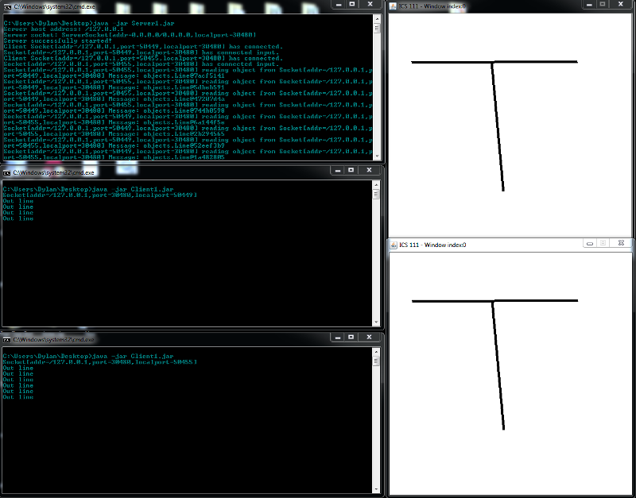

Initially, I wanted to figure out how games sent data from client to server and then from server to client. The scope of detail was out of my knowledge. So, I ended up searching up details on how to just simply send data between the two, the server and the client. This eventually lead me to implementations that utilized sockets. This was a perfect solution for what I wanted to accomplish. By looking at various implementations and modifying them to be used with what I had.

In the picture above, we see three command prompts. The top most command prompt was used to execute the server program and the bottom two are the clients connecting to the server. Since I do not have access to multiple internet connections, I simply used localhost as the server address. I used EZ Graphics as a simple way to visualize the objects that I was sending and receiving. One line was drawn in the top client and another using the bottom client. This can be seen by looking at the top most command prompt, the server, and seeing that a connection from a different port was in fact receiving objects from the connection on the other port. In this case the two connections were on 127.0.0.1:50455 and 127.0.0.1:50449. We also see that from the client command prompts, the clients were sending out data to the server.

The implementation that I utilized might not be the most optimal, especially considering that this was being executed on the same connection. I do not know what the effects are if data is lost in transmission and so forth. However, I was able to get an implementation working that sent out line objects to the server and to the other client and thus keeping the picture seen on each client to be the same. This was also a rather hard topic to just try to pick up as my understanding of the networking in general may not be up to par.
