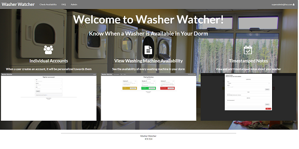
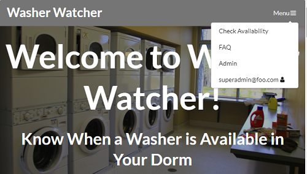

This website was created with the intention of helping the students living in the University of Hawaii at Manoa dorms. This website allows for washing machines to be added to specific dorms. Then, anyone who uses a machine can update the status so that other people know whether or not they could walk down to the laundry room and be able to use a washing machine right then and there. You can find more information about this project on the <a href="https://washerwatcher.github.io/">GitHub page.</a>

On this project, the core issues that I was involved with included the creation of the washing machine component and collection / schema, user preferences, and admin functionality. Beyond this, I also worked on various aesthetic things like washing machine action modals, image modals, and a responsive navbar based on screen width. Lastly, I enabled basic http requests so that washing machines could be updated remotely. This would allow for washing machine statuses to be updated automatically using an SBC, such as a Raspberry Pi and a motion sensor. However, automatic updates were not implemented as we lacked the time.

The one thing that I found really interesting was the implementation of the responsive navbar. The navbar appears in full as long as it can display all the elements on it and then collapses to a clickable menu once the width becomes too small. It was surprisingly easy to implement once I found out the necessary information. All that was really necessary was to listen to the resize event and then render a different component based on the size. Perhaps the method I used may not be the best solution, however, it was an easy one to implement with the knowledge that I had.


<p>
  The collapsed version of the navbar.
</p>

The following is a snippet of code that allowed me to get the size of the window to determine whether or not to render the collapsed version of the navbar.

```Javascript
window.addEventListener('resize', this.updateWindowDimensions);
```

This project was a real eye opener for me. It allowed me to actually create a real, working website. It was all pretty easy to do with the help of the various technologies used, such as Meteor, React, and Semantic UI. It was tough in the beginning, getting used to using these various technologies, however, as time passed, it became easier and easier. I also learned, at least the basics, of team management and issue driven development. This was an experience that will last with me for a long time, as I feel that I gained a lot through this.


